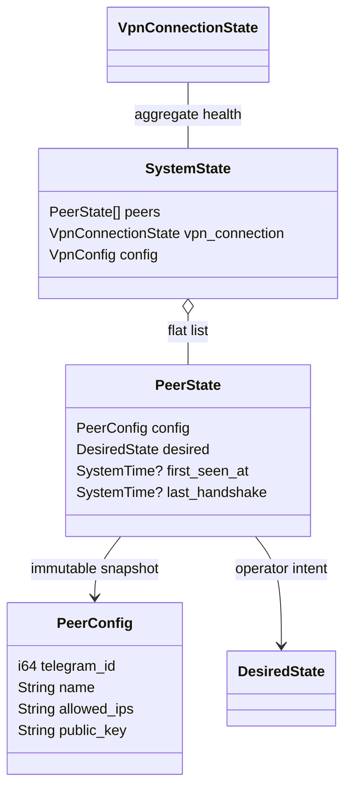
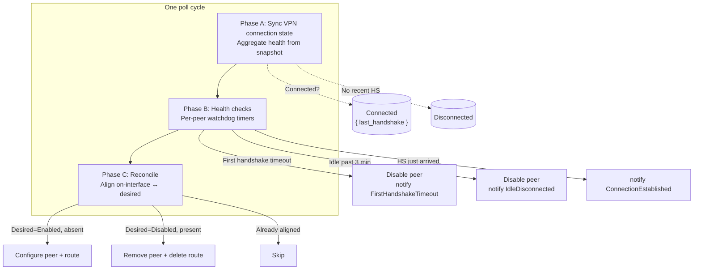
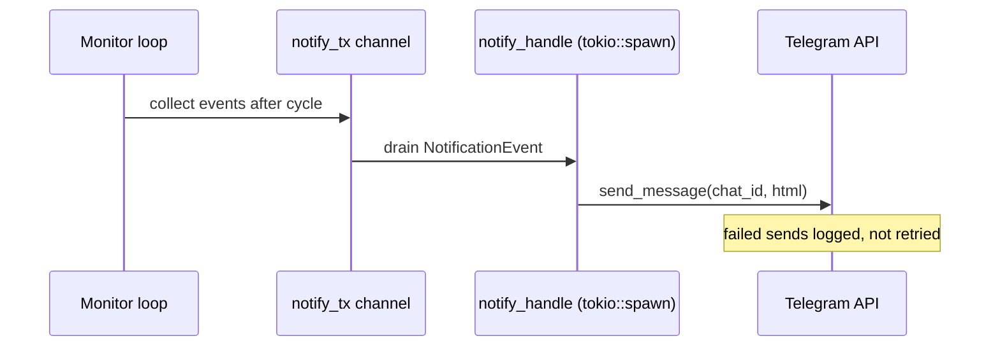
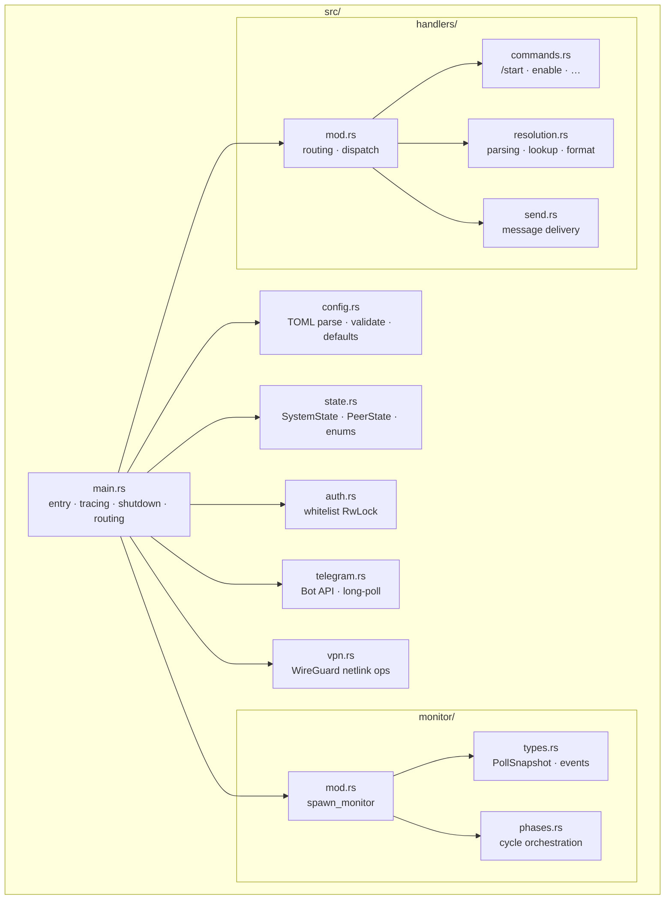
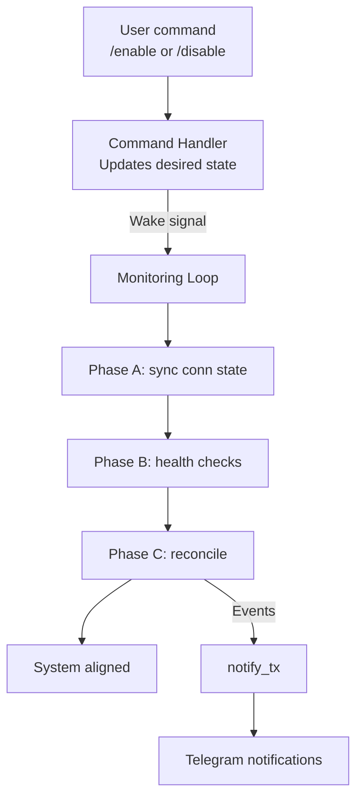

# Architecture: Telegram VPN Bot

## 1. Core Concept: Declarative Controller

The system follows a **declarative reconciliation pattern**, similar to Kubernetes controllers:

- **Desired state** lives in `SystemState.peers[].desired` — set by command handlers when a user runs `/enable` or `/disable`.
- **Actual state** is read fresh from the WireGuard kernel module on every poll cycle via `PollSnapshot`. Nothing is cached in memory.
- A **single monitoring loop** (`monitor::spawn_monitor`) continuously reconciles desired ↔ actual.

There is **no persistent `ActualState` field** on `PeerState`. The kernel *is* the source of truth for what is currently on the interface.

## 2. Data Model

### 2.1 Configuration (static, from TOML)

Defined in `config.rs`:

```rust
struct Config {
    bot: BotConfig,             // token
    polling: PollingConfig,     // timeout, limit
    whitelist: WhitelistConfig, // authorized users
    vpn: VpnConfig,             // interface + peers + tuning params
}

struct PeerConfig {
    telegram_id: i64,
    name: String,
    allowed_ips: String,    // CIDR string (e.g. "10.8.0.2/32")
    public_key: String,     // base64 encoded
}
```

Note: there is **no endpoint** field. Peers are added to a pre-existing interface
configured by the sysadmin; the bot only manages peer keys and routes.

### 2.2 Runtime State (in-memory, single source of truth)

Defined in `state.rs`:



All peers start in `Disabled`. The system uses a **flat vector** rather than a
hash map — lookup is O(n) but peer counts are small (~50).

### 2.3 Connection State (global VPN health)

`VpnConnectionState` tracks aggregate connection health across ALL peers.
It is synced once per cycle from the snapshot: if any peer has a recent
handshake AND is present on the interface, the VPN is considered connected.

## 3. Monitoring Loop (Single Point of Truth)

One async task runs forever inside `monitor.rs`:

```
loop {
    wait_for(poll_timer || wake_signal);
    drain_wake_signals();
    run_full_cycle(state);
    dispatch_notifications(events);
    schedule_next_poll();
}
```

Each cycle has **three phases**:



### Phase A: Sync VPN Connection State

Reads the snapshot and updates `state.vpn_connection`:

- If any peer is present AND has a non-zero handshake → `Connected { last_handshake }`
- Otherwise → `Disconnected`

This is purely informational — no side effects.

### Phase B: Health Checks

Processes each peer individually. Only peers with `desired == Enabled` AND
currently on the interface are examined:

> **Design note.** Health checks are gated solely on *peer presence*, never on
> route presence. If a peer is configured on the WireGuard interface its
> handshake activity is monitored regardless of whether its host route is
> currently in the routing table. A missing route is treated as a transient
> inconsistency that Phase C (reconciliation) will restore; skipping health
> checks while the route is gone would leave the peer invisible to timeout
> and idle detection until the next reconcile cycle repaired it.

Two independent watchdog timers run on every poll while a peer is enabled:

1. **Connection-deadline timer** — counts elapsed seconds since
   `first_seen_at`. If no handshake arrives within the configured window
   (`first_handshake_timeout`, default 60 s), the peer is marked `Disabled`
   and the user receives a `FirstHandshakeTimeout` notification.
   **Reconcile** then removes it from the interface on the next cycle.
2. **Idle watchdog** — counts elapsed seconds since `last_handshake`.
   If the session goes quiet past the hard-coded 180 s threshold, the peer
   is marked `Disabled` and the user receives an `IdleDisconnected`
   notification. **Reconcile** removes it on the next cycle.
3. **Connection established**: On the transition from no-handshake to
   handshake → notify user once.

Both timers read from `PeerState`, never from the kernel directly. The
connection-deadline uses `first_seen_at` (our observation time) instead of
the kernel's `last_handshake` because lib-wg wraps "no handshake" into
`UNIX_EPOCH`, which would otherwise fire immediately.

### Phase C: Reconciliation

For each peer, ensure on-interface state matches declared intent:

| desired | on-interface | action |
|---------|--------------|--------|
| Enabled | Yes | Skip (already aligned) |
| Enabled | No | Configure peer + add route + verify presence |
| Disabled | Yes | Remove peer + delete route |
| Disabled | No | Skip (already aligned) |

Reconciliation calls `vpn::*` directly. Errors are logged but do not crash the
loop — the next cycle will retry.

## 4. Command Handlers (Event-Driven Wake-Up)

When a Telegram update arrives, `main.rs::process_update` runs:

1. Check whitelist (`auth::is_whitelisted`).
2. Parse command text (`handlers::resolution::parse_command`).
3. Route to the appropriate handler in `handlers::commands`.
4. Handlers may call `state.set_desired_for_user(...)` then send a wake signal.

The wake signal triggers immediate loop iteration regardless of poll timing.

Commands supported:

| Command | Handler | Effect |
|---------|---------|--------|
| `/start` | `handle_start` | Welcome message + peer list |
| `/help` | `handle_help` | Show commands |
| `/status` | `handle_status` | List peers with live status |
| `/enable [name]` | `handle_enable` | Set desired=Enabled, wake monitor |
| `/disable [name]` | `handle_disable` | Set desired=Disabled, wake monitor |

If a non-command message is received, it displays help text.

## 5. WireGuard Interface Management

Defined in `vpn.rs`:

- `ensure_wg_peer(iface, pubkey, name, cidr)` — adds a peer to the kernel module. Safe to call repeatedly ("already exists" → Ok).
- `ensure_route(iface, cidr)` — adds an IP route pointing through the interface. Same idempotency guarantee.
- `disable_peer(peer, cfg)` — removes the peer from the WG module AND deletes the associated route. Silently ignores "not found" errors.
- `load_interface_peer(api, allowed_ips)` — finds a peer by CIDR match.
- `get_peer_status(iface, cidr)` — convenience wrapper returning `(bool, PeerInfo)`.

Route management uses `nlink` netlink directly. Routes are identified by
dumping the full table and filtering client-side on destination + prefix +
outgoing interface, since `RTM_GETROUTE` fib-lookup cannot distinguish our
peer-specific route from unrelated routes to the same IP.

## 6. Notification Pipeline

Notifications flow through a dedicated channel:



The monitor collects events during a cycle and sends them all at once. A
separate `tokio::spawn` task drains the channel and forwards to Telegram.
Failed sends are logged but not retried.

Three notification kinds:

- `ConnectionEstablished` — peer completed its first handshake.
- `FirstHandshakeTimeout` — peer timed out waiting for initial handshake.
- `IdleDisconnected` — session went idle past threshold.

## 7. Authentication

Defined in `auth.rs`:

A static `RwLock<Vec<i64>>` holds the authorized user IDs. Initialized once
at startup from `config.whitelist.users`. The lock allows tests to clear
state between runs. Two entry points:

- `init_whitelist_from_config(cfg)` — populates the global list.
- `is_whitelisted(user_id)` — checks membership before processing updates.

Non-whitelisted users receive a rejection message; messages without a sender
are silently denied.

## 8. Shutdown Sequence

On SIGINT or SIGTERM:

1. Lock `SystemState`, iterate all peers with `desired == Enabled`.
2. Call `vpn::disable_peer` for each — removes from interface and deletes route.
3. Drop `wake_tx` so the monitor's receiver closes cleanly.
4. Drop `notify_tx` so the notifier exits.
5. Abort poller and monitor tasks.

Any leftover peers from a previous crash are cleaned up on startup via
`cleanup_peers_on_startup`.

## 9. Logging

Two backends selected based on environment:

- **Journald** — when `$JOURNAL_STREAM` is set (systemd service). Uses
  structured entries with key-value pairs.
- **Stderr** — fallback for development / containers. Unstructured lines.

Log levels follow standard practice:
- `info!` — significant state transitions (startup, peer enabled/disabled).
- `debug!` — expected-but-unusual paths (idempotent operations, already-present peers).
- `warn!` — non-fatal warnings (missing fields, degraded state).
- `error!` — failures requiring attention (API errors, peer ops).

Filter controlled by `RUST_LOG` env var (default: `info`).

## 10. Module Structure



Each box shows the module filename and its primary responsibilities.

## 11. Key Design Decisions

| Decision | Rationale |
|----------|-----------|
| Single monitoring loop | Avoids races between multiple goroutines touching the same state |
| Fresh kernel reads every cycle | No stale cache; `PollSnapshot` captures once per cycle |
| No persistent `ActualState` | Eliminates drift between in-memory state and kernel reality |
| Flat `Vec<PeerState>` | Simpler than HashMap; peer counts are small |
| Command wakes the loop | Sub-second response instead of waiting for poll interval |
| Three-phase cycle (sync → health → reconcile) | Separation of concerns: read, decide, act |
| Dual watchdog timers | Connection-deadline (`first_seen_at`) and idle watchdog (`last_handshake`) serve different purposes; both read from `PeerState` to avoid lib-wg's `UNIX_EPOCH` zero-wrap quirk |
| Timers cleared on lifecycle boundaries | `reconcile_enabled_peer` resets `first_seen_at` and conditionally clears `last_handshake` on successful creation; `reconcile_disabled_peer` clears both on successful removal — each side of the lifecycle leaves `PeerState` clean |
| Health checks gated on peer only | Route loss is transient and handled by reconcile; skipping health monitoring while the route is gone would leave peers invisible to timeout/idle detection |
| Separate notification task | Monitor stays fast; Telegram sends don't block the loop |
| Idempotent peer ops | `ensure_*` and `disable_*` tolerate "already done" gracefully |
| Static whitelist with RwLock | Tests can reset; production writes once at startup |

## 12. Flow Diagram



## 13. Error Handling Strategy

- **Monitor loop never panics**. Each phase catches errors internally.
- **Reconciliation failures** are logged; the next cycle retries automatically.
- **Kernel errors** (e.g., "device not found") during disable are silenced —
  useful for startup cleanup where stale state is expected.
- **Telegram send failures** are logged but not retried (the event is lost).
- **Config validation** rejects duplicate CIDRs, empty fields, and malformed
  inputs before the daemon starts.
- **Signal handling** ensures clean shutdown even mid-operation.
